# github博客搭建记录

## 一、github搭建

### ###搭建分为以下几个步骤：

1. **登录www.github.com网站进行注册和登陆**
		登录后如图所示
	
	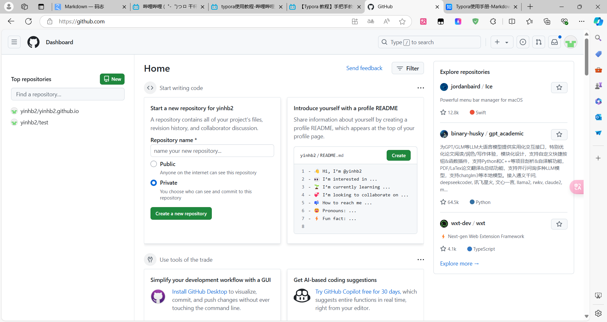
	
	**顶部搜索框中输入==mzlogin==回车**
	这里选择第一个
	
	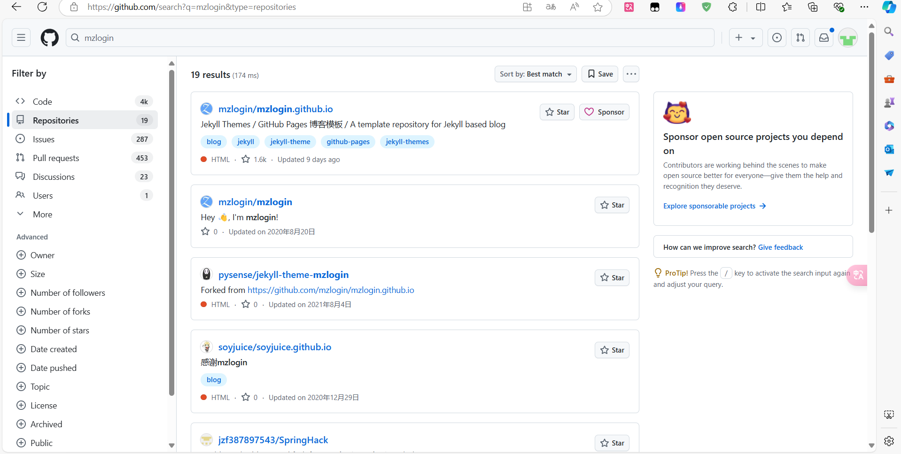

​	

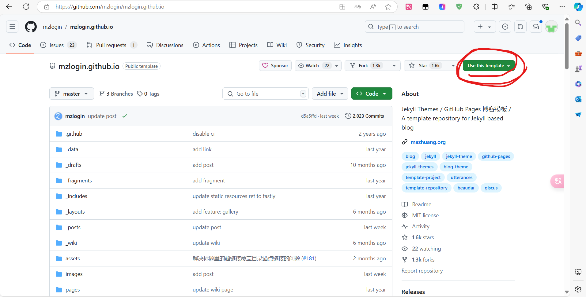
这里点击右上角==use this template==
并选择==create a new repository==

3. **仓库设置**

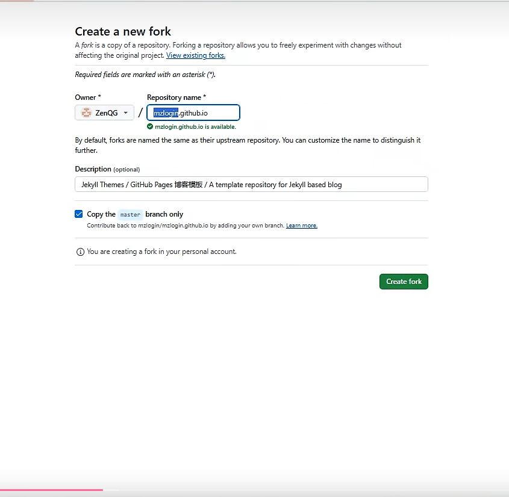

进入该页面后需将Repository name下的标蓝部分替换为自己的名字
description下描述可自行更改
随后点击==create fork==

4. 更改常用设置
	创建仓库后进入如图页面后点击settings
	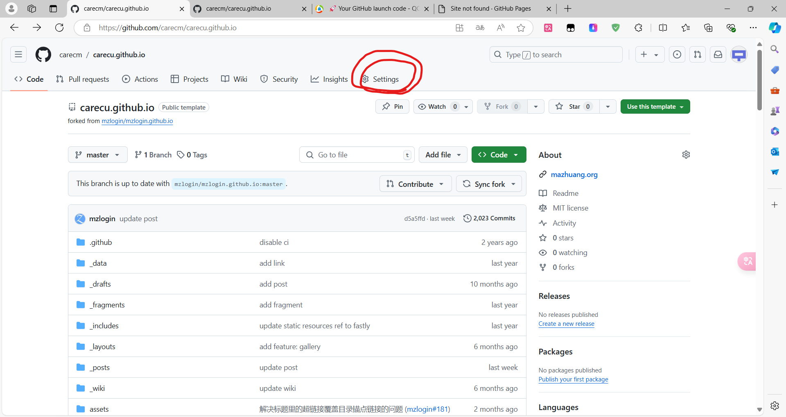

	进入settings后选择左侧pages在branch栏下照图中设置,并点击==save==
	等待同步
	
	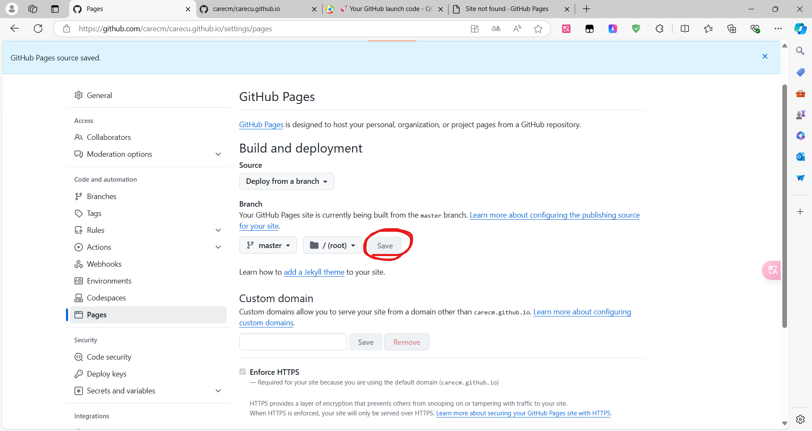

​	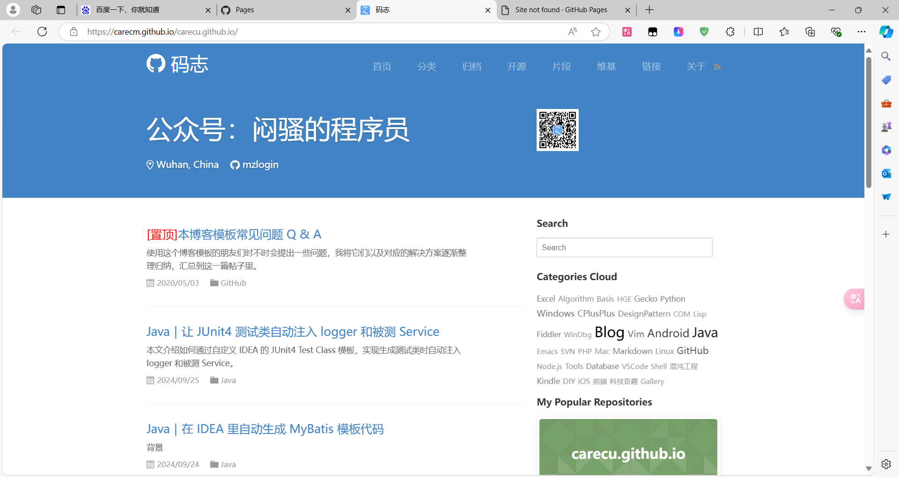	

​	同步后如图所示

## 二、完善博客内容

### 内容修改

1. 删除**fragments**和**posts**文件夹内的原博主上传的内容,后续添加在posts文件夹上传

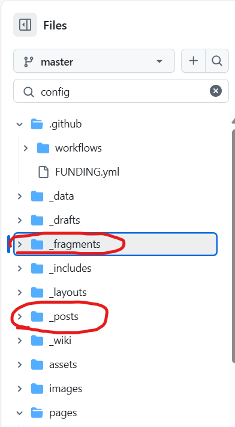

2. 在顶部输入config进入设置文件
	点击右上角铅笔图标edit进入编辑模式
	​将原博主的内容修改为自己的即可

### 评论区设置

1. 在个人仓库页面中选择settings进入设置，在general页面中找到Features栏目下滑找到==Discussions==并勾选

	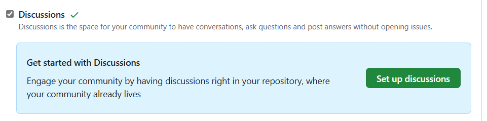

2. 在config文件中185行找到gicus链接https://giscus.app/zh-CN并打开
	下滑找到仓库栏目点击第二条超链接部分安装gicus

	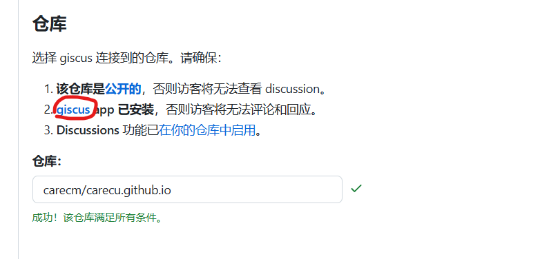

	默认设置进行安装即可
	按照提示输入仓库地址，也可在github个人界面复制

	安装后下方出现==“成功！该仓库满足所有条件”==即可

3. 
	一些设置如图即可

	

	

4. 下滑找到启用giscus红圈内代码

	

​	回到github进入config文件编辑状态，找到187-190行，并对相应位置用红圈内代码替换，与原格式	一致
​	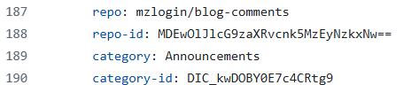

## 三、遇到的小问题

在config文件中修改邮箱时遇到如下报错

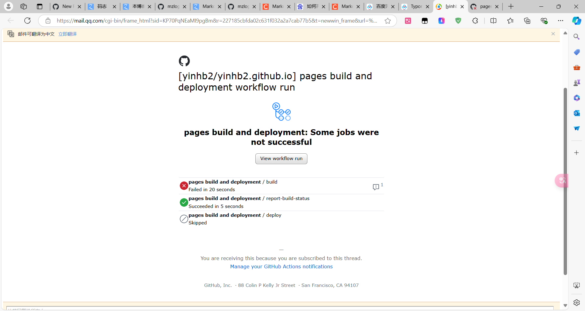

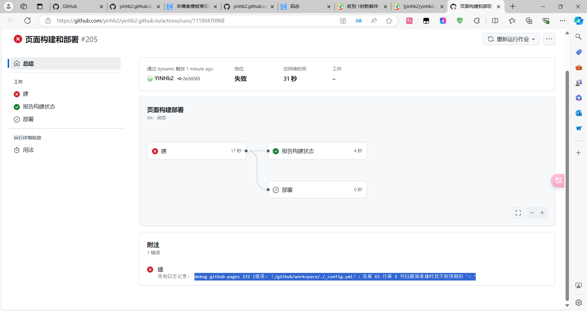

**==注意email和邮箱之间有一空格==**
